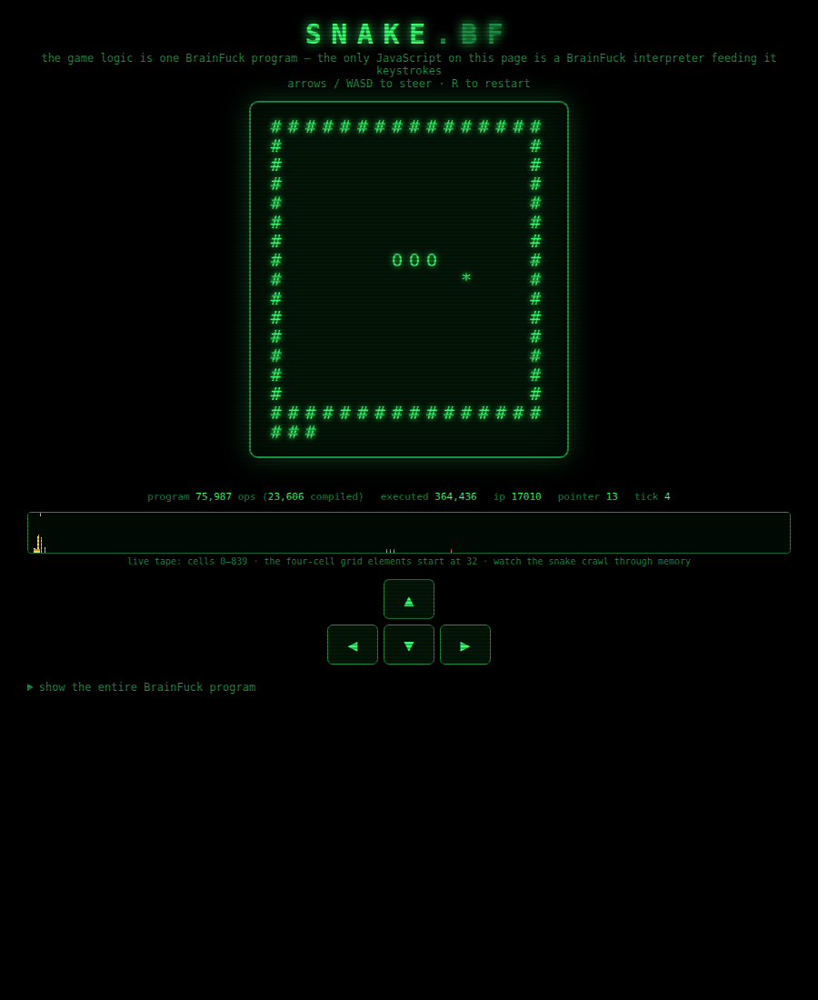

# 🐍 SNAKE.BF — Snake, written in pure BrainFuck, playable in your browser



Every rule of the game — movement, steering, walls, the growing body, the tail
that follows you, the food, the random spawner, death, the score bar, even the
`*** GAME OVER ***` banner — is computed by **one 76 KB BrainFuck program**
([`snake.bf`](snake.bf)) using nothing but the language's eight instructions:

```
+ - < > [ ] . ,
```

The only JavaScript in [`index.html`](index.html) is a dumb BrainFuck
interpreter and its I/O shim: it feeds the program one byte per 110 ms tick
(`0` coast, `1↑ 2↓ 3← 4→`) through `,`, and puts the characters the program
`.`-prints onto a CRT-green `<pre>`. It knows nothing about snakes. You can
watch the proof on the page: a live view of the BrainFuck tape, where the
snake is visibly crawling through raw memory.

## Play it

Open [`index.html`](index.html) in any browser — it's a single self-contained
file, works offline, straight from disk. Arrows / WASD to steer, **R** to
reincarnate. (Or serve the folder: `python3 -m http.server`.)

## How on earth

`snake.bf` is emitted by [`tools/gen_snake.py`](tools/gen_snake.py), a macro
assembler that tracks the tape pointer statically and composes classic
BrainFuck idioms; the emitted program is the artifact, Python never runs at
play time. The fun bits:

- **The board lives on the tape** as 196 four-cell elements `(a, b, f, v)`
  for the 14×14 playfield inside the walls: `f` holds the food marker and `v`
  the snake "age" — the head cell is stamped with the current length, every
  cell decays by 1 per tick, and a segment vanishes exactly when the tail
  leaves it. Growing is just *skipping* the decay for one tick.
- **Random access with a caravan**: to read/write cell *i* (only known at
  run time), a counter walks the `a`-lane leaving a trail of breadcrumb `1`s
  while the payload rides the `b`-lane —
  `[-[->>>>+<<<<]+>[->>>>+<<<<]>>>]` — then the result walks home eating the
  breadcrumbs: `[->>>>>[-<<<<+>>>>]<<<<<<<<<]`. Every indexed operation
  starts and ends at a fixed cell, so the rest of the program can stay
  statically addressed.
- **The RNG is BrainFuck too**: a full-period LCG (`seed = 5·seed + 17 mod
  256`) that is re-rolled until it lands on an empty cell, and stirred by the
  timing of your keystrokes (every input byte is added to the seed).
- **Death by comparison**: leaving the 14×14 field means `x` hit `14` or
  wrapped to `255`; both are plain subtract-and-test-zero checks, and biting
  yourself is "the cell I'm entering is non-zero". Exact reversals are
  ignored because with directions encoded 1–4, a reversal is the only way
  two *different* directions sum to 3 or 7.
- **One `,` per tick is the game clock.** The program renders a frame, asks
  for a byte, and the host's 110 ms metronome is what makes it feel alive.
  Between ticks the machine is parked on the `,` — you can see the pointer
  sitting on cell 13 (the input register) in the stats line.

## Verifying it (because you shouldn't trust a snake)

```
cd tools
python3 test_primitives.py   # caravan array ops & idioms, probed in isolation
python3 test_snake.py        # 24 headless gameplay tests via a reference
                             # interpreter (bf.py): steering, reversal rules,
                             # eating, tail physics, LCG-predicted spawns,
                             # wall & self death, and a 400-tick greedy soak
python3 test_e2e.py          # real Chromium via Playwright: key events in,
                             # frames out, death, restart, no console errors
```

The soak test plays a greedy-but-safe game for hundreds of ticks (last run:
23 foods eaten, length 26, ~92 million BrainFuck steps) asserting board
integrity on every frame.

To rebuild from source:

```
python3 tools/gen_snake.py   # emits snake.bf
python3 tools/build_page.py  # embeds snake.bf into index.html
```

## Scoreboard

| thing | count |
|---|---|
| BrainFuck instructions | 75,987 |
| JavaScript game logic | 0 lines |
| tape cells used | 820 of 30,000 |
| BF steps per frame | ~50,000 |
